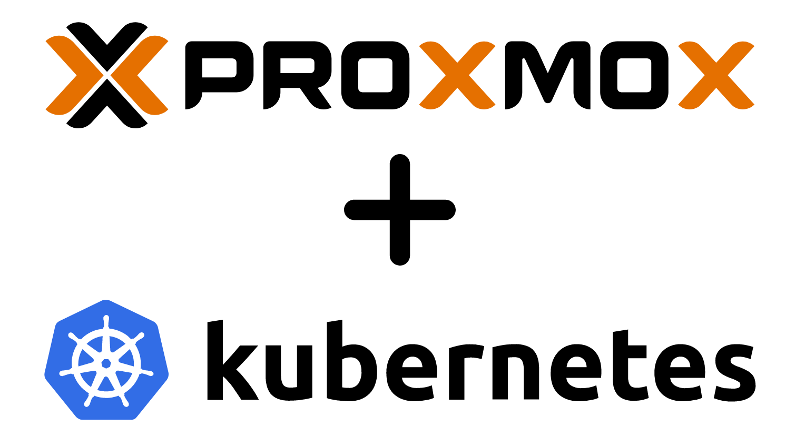

# Complete Guide to Kubernetes Cluster Setup at Proxmox 8.3 on Ubuntu 22.04 LTS: A Step-by-Step Tutorial for DevOps.

# 1. Deploying a Kubernetes master node
The master node itself is not much different from workers during the installation process, so after the initial installation of all the necessary packages, it can be used as a template for worker nodes.
This article will not describe how to work with `Proxmox (PVE)`, it is assumed that you already have experience with this product

## 1.1 Creating a CloudInit template with Ubuntu 22.04

````shell
# Downloading the image:
wget https://cloud-images.ubuntu.com/jammy/current/jammy-server-cloudimg-amd64.img

# Create root password:
sudo apt install libguestfs-tools
virt-customize -a jammy-server-cloudimg-amd64.img --root-password password:<pass>

# Create a new VM:
qm create 9000 --memory 2048 --cores 4 --net0 virtio,bridge=vmbr0 --name Ubuntu-22.04-CloudInit-template

# Import the downloaded disk image into the local-lvm storage:
qm importdisk 9000 jammy-server-cloudimg-amd64.img local-lvm

# Connect the newly created disk to the VM:
qm set 9000 --scsihw virtio-scsi-pci --scsi0 local-lvm:vm-9000-disk-0

# Connect CloudInit CD-ROM drive to VM:
qm set 9000 --ide2 local-lvm:cloudinit

# Additional parameters:
qm set 9000 --boot c --bootdisk scsi0
qm set 9000 --serial0 socket --vga serial0

# Convert to template:
qm template 9000
````

## 1.2 Creating a template for a Kubernetes node
##### Now create the first VM, which will have everything necessary to deploy a Kebernetes node, which we will then also convert into a template:
````shell
qm clone 9000 9001 --name k8s-template --full --storage local-lvm
qm set 9001 --memory 4096 --agent enabled=1
qm resize 9001 scsi0 3G
````

##### Launch the cloned machine `9001`, configure the network and install everything necessary, namely docker and kubernetes.
````shell
# Add new user if necessary and add to sudoers
adduser kuser
usermod -aG sudo kuser
````
##### Network setup (the name of the yaml file may differ, set the settings relevant to your network):
````shell
nano /etc/netplan/50-cloudinit-netcfg.yaml
````

````shell
#network:
  version: 2
  renderer: networkd
  ethernets:
    ens18:
      dhcp4: false
      dhcp6: false
      addresses:
      - 10.10.0.41/24
      routes:
      - to: default
        via: 10.10.0.1
      nameservers:
       addresses: [8.8.8.8,8.8.4.4]
````

````shell
# Apply netplan:
sudo netplan apply

# Update packages:
sudo apt update && sudo apt upgrade -y

# Install qemu-agent:
sudo apt-get install qemu-guest-agent

# Disable swap:
sudo swapoff -a
sudo sed -i '/ swap / s/^\(.*\)$/#\1/g' /etc/fstab

# Add Kernel Parameters:
sudo tee /etc/modules-load.d/containerd.conf <<EOF
overlay
br_netfilter
EOF

sudo modprobe overlay
sudo modprobe br_netfilter

sudo tee /etc/sysctl.d/kubernetes.conf <<EOF
net.bridge.bridge-nf-call-ip6tables = 1
net.bridge.bridge-nf-call-iptables = 1
net.ipv4.ip_forward = 1
EOF

# Reload the changes:
sudo sysctl --system
````

##### Install Containerd Runtime:
````shell
sudo apt install -y curl gnupg2 software-properties-common apt-transport-https ca-certificates

sudo curl -fsSL https://download.docker.com/linux/ubuntu/gpg | sudo gpg --dearmour -o /etc/apt/trusted.gpg.d/docker.gpg
sudo add-apt-repository "deb [arch=amd64] https://download.docker.com/linux/ubuntu $(lsb_release -cs) stable"

sudo apt update
sudo apt install -y containerd.io

containerd config default | sudo tee /etc/containerd/config.toml >/dev/null 2>&1
sudo sed -i 's/SystemdCgroup \= false/SystemdCgroup \= true/g' /etc/containerd/config.toml

sudo systemctl restart containerd
sudo systemctl enable containerd
````

##### Install Kubernetes Components:
````shell
# Add the Kubernetes signing key and repository:
sudo apt-get update
# apt-transport-https may be a dummy package; if so, you can skip that package
sudo apt-get install -y apt-transport-https ca-certificates curl gpg

curl -fsSL https://pkgs.k8s.io/core:/stable:/v1.29/deb/Release.key | sudo gpg --dearmor -o /etc/apt/keyrings/kubernetes-apt-keyring.gpg

# This overwrites any existing configuration in /etc/apt/sources.list.d/kubernetes.list
echo 'deb [signed-by=/etc/apt/keyrings/kubernetes-apt-keyring.gpg] https://pkgs.k8s.io/core:/stable:/v1.29/deb/ /' | sudo tee /etc/apt/sources.list.d/kubernetes.list

# Update the package list and install kubelet, kubeadm, and kubectl
sudo apt-get update
sudo apt-get install -y kubelet kubeadm kubectl
sudo apt-mark hold kubelet kubeadm kubectl

# Enable autostart kubelet.service
sudo systemctl enable kubelet.service
````

##### Back to PVE console and create template:
````shell
qm template 9001
````

## 1.3 Create and config from template Master-node:
````shell
# Clone from template 9001 VM 100 (master-node) and resize disk:
qm clone 9001 100 --name k8s-master --full --storage local-lvm
qm resize 100 scsi0 15G

# Initialize Kubernetes Master Node at VM 100 using kubeadm:
sudo kubeadm init

Output:

[init] Using Kubernetes version: v1.29.0
[preflight] Running pre-flight checks
[preflight] Pulling images required for setting up a Kubernetes cluster
[preflight] This might take a minute or two, depending on the speed of your internet connection
[preflight] You can also perform this action in beforehand using 'kubeadm config images pull'
W1217 13:50:54.561046   43242 checks.go:835] detected that the sandbox image "registry.k8s.io/pause:3.6" of the container runtime is inconsistent with that used by kubeadm. It is recommended that using "registry.k8s.io/pause:3.9" as the CRI sandbox image.
[certs] Using certificateDir folder "/etc/kubernetes/pki"
[certs] Generating "ca" certificate and key
[certs] Generating "apiserver" certificate and key
[certs] apiserver serving cert is signed for DNS names [k8s-master kubernetes kubernetes.default kubernetes.default.svc kubernetes.default.svc.cluster.local] and IPs [10.96.0.1 10.10.0.41]
[certs] Generating "apiserver-kubelet-client" certificate and key
[certs] Generating "front-proxy-ca" certificate and key
[certs] Generating "front-proxy-client" certificate and key
[certs] Generating "etcd/ca" certificate and key
[certs] Generating "etcd/server" certificate and key
[certs] etcd/server serving cert is signed for DNS names [k8s-master localhost] and IPs [10.10.0.41 127.0.0.1 ::1]
[certs] Generating "etcd/peer" certificate and key
[certs] etcd/peer serving cert is signed for DNS names [k8s-master localhost] and IPs [10.10.0.41 127.0.0.1 ::1]
[certs] Generating "etcd/healthcheck-client" certificate and key
[certs] Generating "apiserver-etcd-client" certificate and key
[certs] Generating "sa" key and public key
[kubeconfig] Using kubeconfig folder "/etc/kubernetes"
[kubeconfig] Writing "admin.conf" kubeconfig file
[kubeconfig] Writing "super-admin.conf" kubeconfig file
[kubeconfig] Writing "kubelet.conf" kubeconfig file
[kubeconfig] Writing "controller-manager.conf" kubeconfig file
[kubeconfig] Writing "scheduler.conf" kubeconfig file
[etcd] Creating static Pod manifest for local etcd in "/etc/kubernetes/manifests"
[control-plane] Using manifest folder "/etc/kubernetes/manifests"
[control-plane] Creating static Pod manifest for "kube-apiserver"
[control-plane] Creating static Pod manifest for "kube-controller-manager"
[control-plane] Creating static Pod manifest for "kube-scheduler"
[kubelet-start] Writing kubelet environment file with flags to file "/var/lib/kubelet/kubeadm-flags.env"
[kubelet-start] Writing kubelet configuration to file "/var/lib/kubelet/config.yaml"
[kubelet-start] Starting the kubelet
[wait-control-plane] Waiting for the kubelet to boot up the control plane as static Pods from directory "/etc/kubernetes/manifests". This can take up to 4m0s
[apiclient] All control plane components are healthy after 8.001522 seconds
[upload-config] Storing the configuration used in ConfigMap "kubeadm-config" in the "kube-system" Namespace
[kubelet] Creating a ConfigMap "kubelet-config" in namespace kube-system with the configuration for the kubelets in the cluster
[upload-certs] Skipping phase. Please see --upload-certs
[mark-control-plane] Marking the node k8s-master as control-plane by adding the labels: [node-role.kubernetes.io/control-plane node.kubernetes.io/exclude-from-external-load-balancers]
[mark-control-plane] Marking the node k8s-master as control-plane by adding the taints [node-role.kubernetes.io/control-plane:NoSchedule]
[bootstrap-token] Using token: qyq7z7.5auk8bcovin856fj
[bootstrap-token] Configuring bootstrap tokens, cluster-info ConfigMap, RBAC Roles
[bootstrap-token] Configured RBAC rules to allow Node Bootstrap tokens to get nodes
[bootstrap-token] Configured RBAC rules to allow Node Bootstrap tokens to post CSRs in order for nodes to get long term certificate credentials
[bootstrap-token] Configured RBAC rules to allow the csrapprover controller automatically approve CSRs from a Node Bootstrap Token
[bootstrap-token] Configured RBAC rules to allow certificate rotation for all node client certificates in the cluster
[bootstrap-token] Creating the "cluster-info" ConfigMap in the "kube-public" namespace
[kubelet-finalize] Updating "/etc/kubernetes/kubelet.conf" to point to a rotatable kubelet client certificate and key
[addons] Applied essential addon: CoreDNS
[addons] Applied essential addon: kube-proxy

Your Kubernetes control-plane has initialized successfully!

To start using your cluster, you need to run the following as a regular user:

  mkdir -p $HOME/.kube
  sudo cp -i /etc/kubernetes/admin.conf $HOME/.kube/config
  sudo chown $(id -u):$(id -g) $HOME/.kube/config

Alternatively, if you are the root user, you can run:

  export KUBECONFIG=/etc/kubernetes/admin.conf

You should now deploy a pod network to the cluster.
Run "kubectl apply -f [podnetwork].yaml" with one of the options listed at:
  https://kubernetes.io/docs/concepts/cluster-administration/addons/

Then you can join any number of worker nodes by running the following on each as root:

kubeadm join 10.10.0.41:6443 --token zaahyi.sqtus5x715ovb1tz \
        --discovery-token-ca-cert-hash sha256:8b559269db6d4ea4051c2989d8860486d10bfa709d44eba8d91fd57a7a633ae7
````

##### To start using your cluster, set up the kubeconfig:
````shell
mkdir -p $HOME/.kube
sudo cp -i /etc/kubernetes/admin.conf $HOME/.kube/config
sudo chown $(id -u):$(id -g) $HOME/.kube/config
````

##### Deploy a Pod Network:
````shell
# Install a pod network so that your nodes can communicate with each other:
sudo kubectl apply -f https://raw.githubusercontent.com/projectcalico/calico/v3.25.0/manifests/calico.yaml
````

## 1.4 Setting up the Worker Nodes (back to PVE console):
````shell
# Clone from template 9001 VM 101, 102, 103 (worker-nodes) and resize disks: 
qm clone 9001 101 --name k8s-worker-1 --full --storage local-lvm
qm resize 101 scsi0 40G

qm clone 9001 102 --name k8s-worker-2 --full --storage local-lvm
qm resize 102 scsi0 40G

qm clone 9001 103 --name k8s-worker-3 --full --storage local-lvm
qm resize 103 scsi0 40G

# Reset at all of cloned vm machine-id and reboot:
sudo rm /etc/machine-id
sudo systemd-machine-id-setup
sudo reboot

# Configure network if necessary, example at 1.2
````

##### Join the Worker Nodes to Master-node:
````shell
# Run at worker nodes console:
kubeadm join 10.10.0.41:6443 --token zaahyi.sqtus5x715ovb1tz \
        --discovery-token-ca-cert-hash sha256:8b559269db6d4ea4051c2989d8860486d10bfa709d44eba8d91fd57a7a633ae7
````

####    # Verifying the Cluster Setup
````shell
# Ensure your cluster is up and running (At node with control-plane = master node):
kubectl get nodes


Output:

NAME               STATUS   ROLES           AGE     VERSION
k8s-master     Ready    control-plane   10m     v1.29.0
k8s-worker-1   Ready    <none>          4m31s   v1.29.0
k8s-worker-2   Ready    <none>          3m16s   v1.29.0
k8s-worker-3   Ready    <none>          2m10s   v1.29.0
````

## Conclusion
You’ve successfully set up a Kubernetes cluster at Proxmox 8.3 on Ubuntu 22.04 LTS. This basic cluster is ready for deploying applications and further exploration of Kubernetes’ capabilities.

## Links of used documentation:
1. [Setting up a Kubernetes cluster on virtual machines in a Proxmox VE 7.2 environment](https://ex-minds.ru/kubernetes-proxmox-install/)
2. [Complete Guide to Kubernetes Cluster Setup on Ubuntu 22.04 LTS : A Step-by-Step Tutorial for DevOps](https://medium.com/@kvihanga/how-to-set-up-a-kubernetes-cluster-on-ubuntu-22-04-lts-433548d9a7d0)
3. [Proxmox wiki](https://pve.proxmox.com/wiki/Main_Page)
4. [Ubuntu Cloud Images](https://cloud-images.ubuntu.com/)
5. [How do I set a password on an Ubuntu cloud image?](https://serverfault.com/questions/920117/how-do-i-set-a-password-on-an-ubuntu-cloud-image)
6. [Netplan static IP on Ubuntu configuration](https://linuxconfig.org/how-to-configure-static-ip-address-on-ubuntu-18-04-bionic-beaver-linux)